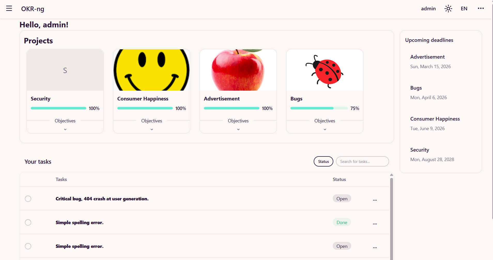
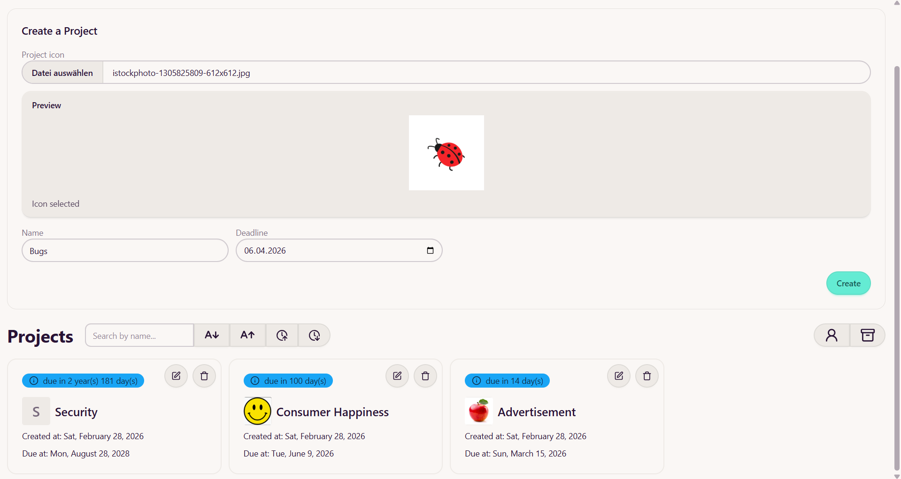
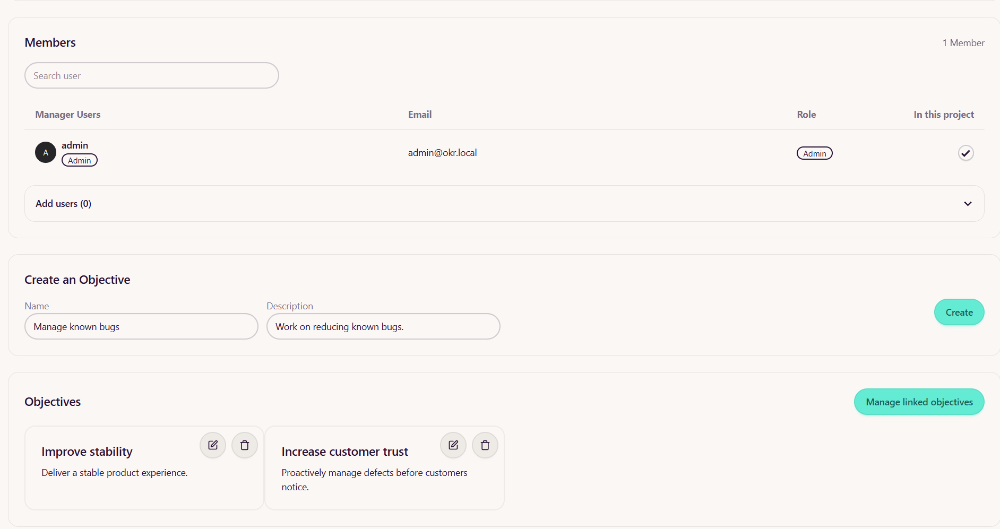

# OKR Software for Groups

A modern, team-based OKR management platform designed to structure goals, measure progress, and improve transparency across projects.

This software was developed as part of a university software engineering project, with a strong focus on clean architecture, security, and maintainability, while keeping real-world usability in mind.

---

##  What are OKRs?

**Objectives and Key Results (OKRs)** are a goal-setting framework used by teams and organizations to define ambitious goals and measurable outcomes.

- **Objective** → What do we want to achieve?
- **Key Result** → How do we measure success?
- **Tasks** → What needs to be done to achieve it?

Our platform provides a structured way to manage OKRs across multiple teams and projects.

---

##  Key Features

-  Dashboard with active projects, open tasks, and upcoming deadlines  
-  Central project overview & project creation  
-  Objective management per project  
-  Cross-project objective linking (objectives can be connected across projects)  
-  Key Result tracking with visible progress  
-  Task management per Key Result  
-  Team-based structure with role management:
    - **Admin** – full system access
    - **Team Lead** – manages assigned projects
    - **Member** – contributes to project OKRs
-  Currently supported languages:
    - English
    - German  
   You can add new languages by adding a new locale file in the [i18n folder] (src/lib/i18n/locales).
-  Advanced authentication:
    - WebAuthn (passkey-based authentication)
    - TOTP-based two-factor authentication
-  Docker support for simplified deployment

---

##  Screenshots

###  Dashboard

###  Project Creation & Overview

###  Objective Management & Linking

---

##  Tech Stack

### Frontend
- **SvelteKit**
- **DaisyUI**

### Backend
- **Litestar**
- **SQLAlchemy**

### Infrastructure
- Docker support

---

##  Security

Security was a core focus of this project.

- Multi-factor authentication:
    - WebAuthn support
    - TOTP-based one-time passwords
- Role-based access control
- Secure session handling via JSON Web Tokens (JWT)

---

##  Project Background

This project was developed in a university setting but designed with production-oriented standards in mind:

- Modular architecture
- Clean separation of frontend and backend
- Secure authentication mechanisms
- Maintainable and extensible code structure

---

## Development

> [!NOTE]
> Before you can follow any of the other steps, you first have to install all dependencies by running the command below.
>

### Install dependencies
- `pnpm install`

### Run the project (development)
- `pnpm run dev`

### Build and run the production build
- `pnpm run build`
- `pnpm run preview`

### Running code quality checks
- Type-checking (via Svelte Typecheck): `pnpm run check`
- Linting (via Biome): `pnpm run lint`
- Auto-formatting (via Biome): `pnpm run format`

### Run E2E integration tests (Playwright)
> [!NOTE]
> The tests require you to have the backend running on port 8000!
>
- `pnpm run test:e2e`

### Run the full CI pipeline locally (linter, type-checker and tests)
- `pnpm run ci`

> [!NOTE] 
> Playwright uses `http://localhost:4173` as baseURL and will automatically start a preview server via `pnpm run build && pnpm run preview:ci`.
>
---

## Backend / API

- Backend repository: https://github.com/tpse-81/okr
- Developer API documentation: https://tpse-81.github.io/okr/
